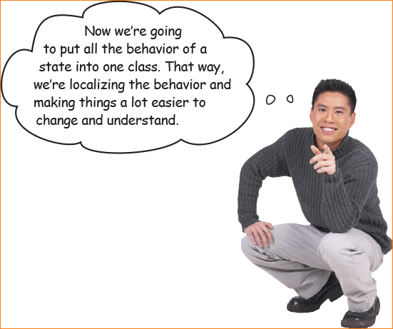

# State Activity - Universal Fortune Machine!

## What is the State Pattern?

[State Pattern](https://www.google.com/url?q=https%3A%2F%2Flearning.oreilly.com%2Flibrary%2Fview%2Fhead-first-design%2F9781492077992%2Fch10.html%23sharpen_your_pencil-id000312&sa=D&sntz=1&usg=AOvVaw3IR7fqrzyzeeQdLOClNHn_)

The state pattern is based on state machines, those fun things you may have learned about in Theory. You have multiple states, and all the behavior of the program is based on which state you're in. Transitioning between states is what changes the program's behavior.

Let's make some states!

## Introducing: The Fortune Machine!

At Incorporated Enterprises INC's R&D Laboratory a powerful new idea has emerged! A fortune machine *of the people*!
In order to receive wisdom, you must first dispense it. The machine takes in submitted strings, one at a time, in an `input` queue. Each one representing your own personal words of wisdom. Upon vending you get the same number of random fortune strings that were submitted to the machine. Our engineers believe that by connecting this machine to the internet we could have *universal wisdom*.

The fortune machine holds its current state in the instance variable `state`. The instance variable `library` holds all the possible fortunes (we have lovingly supplied some for you), `prizes` holds all the dispensed strings, and `inputs` holds all the beautiful fortunes you've put in but haven't yet added to the library (inputs get added to the library using the `vend` function, at the same time you get your fortunes.)

To use the machine, first make a machine with `FortuneMachine new`, then submit any fortunes you want to give it with `machine addFortune: 'fortune'`. When you're done, run `machine submit` and `machine vend` to get YOUR pre-ordained fortunes from the machine. R

Inspect the function of the fortune machine!

Submission test!

```smalltalk
|machine|
machine := FortuneMachine new.
machine addFortune: 'I am submitting to the machine'.
machine submit.
machine vend.
```

Submit multiple strings!

```smalltalk
|machine|
machine := FortuneMachine new.
machine addFortune: 'I am submitting to the machine'.
machine addFortune: 'I am another string in the machine'.
machine submit.
machine vend.
```
## Revelation!
Your boss just got back from his trip to Nepal and wants to ensure the fortune machine stands in line with *everyone's* values! Only universally accepted wisdom should be dispensed! This is going to mean adding a user-submittable word filtering system! Create a word filter that censors our user-submitted filter substrings fortunes. If anyone tries to submit a negative fortune, we will lock the machine until it's resent.

Look at all the conditionals in the FortuneMachine's action methods! We have to edit all those? ooof. This all seems pretty messy. Good thing our fortune machine runs Pharo!

1. Add a new instance variable to `FortuneMachine` called `filteredWords`
2. In the initializer add negative words to `fileredWords`, like "sad" or "angry".
3. Add a new state `#negativity`.
   - You will have to add another `ifTrue` check to each action method, that should deny the transaction with `denyTransaction`.
   - In the `submit` action, you will need to check if any of the input strings have negative words. If so, enter the #negativity state and do not add them to the fortunes.
     - Suggestion: add a helper method that checks the submitted fortunes and returns a boolean.
     - Hint! Open Finder and pull up the OrderedCollection class to look for available methods that might help you :)
   - experience disgust. It looks bad, right?
4. See if you can get the word filter to apply in the Playground, make sure to apply your word filter before starting to use `machine submit:`.
 
### Takeways
- The use of literals opens the possiblity of typo's - this would be solved by an `Enum` type in a typed language.
- The order of evaluation in the action methods matters. Ew!
- To add a state, we change every single action method. This violates the principle of `open to extension, closed to modification`. We should only have had to change the `submit` action!
- It is generally a bad sign when your OO code has a lot of if methods. The object-oriented solution would be to use dynamic dispatch: create subclasses of `FotuneMachine` for each type of behavior, and then update the instance with the appropriate subclass. Unfortunately, this doesn't work since we want to preserve the library, prizes, and submitted fortunes between states!
 
## Let's apply the State pattern!



Wouldn't it work better if we were to take this one behavior of the fortune machine and encapsulate it, so we can avoid the messy inheritence situation from turning each state into a subclass of fortune machine or chaining we have the state pattern!

1. Create a `FortuneState` class
   - Each `FortuneState` will hold the fortune machine in an instance variable.
   - Add abstract methods for the three actions: `addFortune:`, `submit`, and `vend` that call `self subclassResponsibility`. 
   - Add a `forMachine: machine` constructor (i.e. class method) that creates a new state with `self new` and sets the machine instance variable.
2. Now, `FortuneMachine` is going to represent the machine itself, and `FortuneState` will represent the machine's state.
   - To do this, the `state` instance variable on `FortuneMachine` will hold a FortuneState instead of a literal: `state := NoInput forMachine: self`.
3. Change all the action methods from `FortuneMachine`. Now, all they should do is send on the function to their state. (i.e.  `submit: text` should do `state submit: text`).
4. Create subclasses  of `FortuneState` for each possible state: `HasInput` `NoInput` and `Vending`
   - In each state subclass, add the appropriate behavior for the action methods within the context of that state.
   - Reference the original actions to see which states should be able to transition to other states, and which methods should cause them to transition.
   - To transition to a new state, you will be calling `machine state: (StateName forMachine: machine)`. 
7. Ensure that the action methods of the state subclasses correctly transition ex: `machine state: (Vended forMachine: machine)`

Izzy Thompson, Katie Browne, [Turner Hall (contact info)](https://gnu3.xyz/)


