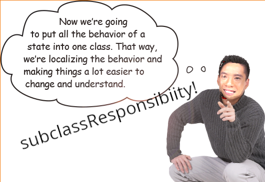

# State Activity

1. What is the State Pattern?


2. Introducing: The Fortune Machine!

At Incorporated Enterprises INC's R&D Laboratory a powerful new idea has emerged! A fortune machine *of the people*!
In order to receive wisdom, you must first dispense it. The machine takes in submitted strings, one at a time, in an `input` queue. Each one representing your own personal words of wisdom. Upon vending you get the same number of strings that were submitted to the machine. Our engineers believe that by connecting this machine to the internet we could have *universal wisdom*.

Inspect the function of the fortune machine!

Submission test!

```smalltalk
|machine|
machine := FortuneMachine new.
machine submit: 'I am submitting to the machine'.
machine vend.
```

Submit multiple strings!

```smalltalk
|machine|
machine := FortuneMachine new.
machine submit: 'I am submitting to the machine'.
machine submit: 'I am another string in the machine'.
machine vend.
```

3.Boss wants to ensure the fortune machine stands in line with *everyone's* values! Only universally accepted wisdom should be dispensed! This is going to mean adding a user-submittable word filtering system! Create a word filter that censors our user-submitted filtered substrings from fortunes.

Look at all the conditionals in the FortuneMachine's action methods! We have to edit all those? ooof.
 


This all seems pretty messy. Good thing our fortune machine runs pharo!

4. Let's apply the State pattern!



Wouldn't it work better if we were to take this one behavior of the fortune machine and encapsulate it, so we can avoid the messy inheritence situation from turning each state into a subclass of fortune machine or chaining we have the state pattern!

1. Create a `FortuneState` class with subclasses `HasInput` `WordFilter` `NoInput` and `Vended` seperate from `FortuneMachine`
2. Delete all the action methods from `FortuneMachine`
3. Add methods to `FortuneState` for the action methods `submit:` and `vend` which delegate subClassResponsibility
4. In each state subclass, add the appropriate behavior for the action methods within the context of that state.
    - (You may want to create a Finite State Machine diagram of the FortuneMachine and ask us questions)
5. Ensure that the action methods of the state subclasses correctly transition ex: `machine state: (Vended forMachine: machine)`
6. The `vend` method in the WordFilter state should add any submitted strings to our `FortuneMachine`'s word filter!

### States:
 - No String to add
 - Strings to add
 - Word filter to add
 - string vended (they are just strings other people uploaded)

Izzy Thompson, Katie Browne, [Turner Hall (contact info)](https://gnu3.xyz/)


